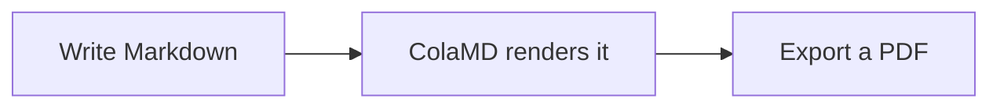

# Markdown Syntax Reference

ColaMD supports the Markdown syntax you use every day, plus highlights, task lists, and formulas.

This document doubles as a demo: images, links, footnotes, formulas, HTML, and diagrams are all live below.

## Headings

# Heading 1

## Heading 2

### Heading 3

Source: add `#` and a space before the heading text. Use up to six `#` characters.

## Emphasis

**Bold**, *italic*, ~~strikethrough~~, `inline code`, and ==highlight==

Source: `**bold**`, `*italic*`, `~~strikethrough~~`, and `==highlight==`.

## Links

[ColaMD](https://github.com/marswaveai/ColaMD)

Hold Cmd / Ctrl while clicking a link to open it in your browser. `[Jump](#headings)` moves to a heading in the document.

Source: `[label](https://example.com)`

## Images


Source: ``. Local relative paths and web images both work; a relative path is resolved against the folder this document lives in.

## Lists

- Unordered item
- Another item

1. Ordered item
2. Another item

Source: `- item` or `* item`; ordered lists use `1. item`.

## Task lists

- [ ] An unfinished task
- [x] A completed task

Click the checkbox to toggle it. You can also place the cursor on a task and press Cmd / Ctrl + Enter.

Source: `- [ ] unfinished` and `- [x] completed`.

## Code

Inline code: `const answer = 42`

```js
// Name the language and the block is highlighted
const greeting = 'hello'
function hello(name) {
  return greeting + ' ' + name
}
```

Source: wrap inline code in one backtick; use three backticks for a fenced code block, with the language name (`js`, `python`, `go`, …) on the first line for syntax highlighting. Hover the block and a copy button appears in its top right corner.

## Quotes and rules

> A quoted paragraph.

---

Source: add `>` at the beginning of a quote. Put `---` on a line by itself for a horizontal rule. When playing the slideshow, `---` is also a page break (View → Play Slideshow, ⌘⇧P).

## Tables

| Name | Description |
| --- | --- |
| ColaMD | Agent Native Markdown editor |

Source: separate columns with `|` and use `---` in the second row.

## Formulas

Inline: $a^2 + b^2 = c^2$.

$$
E = mc^2
$$

Source: wrap inline formulas in a pair of `$`, and put a block formula on its own lines between a pair of `$$`. A `$` followed by a digit stays plain text, so a price like $349 is never mistaken for a formula.

## Footnotes

Write a footnote marker[^1] and hover it to read the note.

[^1]: The note itself goes here. It can live anywhere in the document; ColaMD folds it into this line.

Source: `[^1]` in the text, and `[^1]: the note` somewhere in the document.

## HTML

Inline HTML works as written: <u>an underline</u>, <mark>a highlight</mark>.

<div style="padding: 10px 14px; border-left: 3px solid #8a8a8a; background: rgba(127, 127, 127, 0.08);">
This is an HTML block, and it can carry its own layout styles.
</div>

Source: write the tags directly. For safety, `script`, `iframe`, and `on*` handlers are dropped, and only layout-related style properties are kept.

## Diagrams



Source: a fenced code block with the `mermaid` language. Click a diagram to edit its source again.

## Smart line breaks

A single newline in Markdown is rendered as a line break. This matches the way people and AI agents commonly write Markdown.
