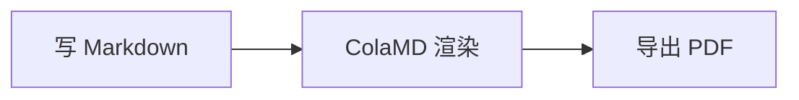

# Markdown 语法速查

ColaMD 支持下面这些 Markdown 格式。每个示例下方是它的源码写法。

这份文档同时是功能演示：图片、链接、脚注、公式、HTML、图表都能在上面看到实际效果。

## 标题

# 一级标题

## 二级标题

### 三级标题

源码：在文字前加 `#`，一个 `#` 是一级标题，两个是二级，以此类推（最多六级）。

## 强调

**加粗**、*斜体*、~~删除线~~、==高亮==

源码：`**加粗**`、`*斜体*`、`~~删除线~~`、`==高亮==`

## 链接

[ColaMD](https://github.com/marswaveai/ColaMD)

Cmd/⌘+点击链接会在浏览器中打开；`[跳到某一节](#标题)` 会跳到文内对应的标题。

源码：`[文字](https://链接地址)`

## 图片


源码：``。本地相对路径和网络图片都支持，相对路径是相对这份文档所在的位置算的。

## 列表

- 无序列表项
- 另一个列表项

1. 有序列表项
2. 另一个列表项

源码：`- 列表项` 或 `* 列表项`；有序列表用 `1. 列表项`。

## 待办列表

- [ ] 未完成的事项
- [x] 已完成的事项

点击左侧复选框即可切换状态；也可以把光标放在待办行，按 Cmd/⌘+Enter（Windows 为 Ctrl+Enter）切换。

源码：`- [ ] 未完成`，勾选后写作 `- [x] 已完成`。

## 代码

行内代码：`const x = 1`

代码块：

```js
// 写上语言名就有语法着色
const greeting = 'hello'
function hello(name) {
  return greeting + ' ' + name
}
```

源码：行内代码用单个反引号包裹；代码块用三个反引号包裹，第一行写上语言名（如 `js`、`python`、`go`）就会做语法着色。鼠标停在代码块上，右上角会出现复制按钮。

## 引用与分割线

> 这是一段引用文字。

---

源码：引用在行首加 `>`；分割线单独一行写 `---`。放映幻灯片时，`---` 同时是分页符（视图 → 放映幻灯片，⌘⇧P）。

## 表格

| 名称 | 说明 |
| --- | --- |
| ColaMD | Agent Native Markdown 编辑器 |

源码：用 `|` 分隔列，第二行写 `---` 作为表头分隔线。

## 公式

行内公式：质能方程是 $E = mc^2$。

$$
\int_0^1 x^2 \, dx = \frac{1}{3}
$$

源码：行内公式用一对 `$` 包起来，独占一行的公式用一对 `$$`。`$` 后面紧跟数字时按普通文字处理，所以「$349」这种价格不会变成公式。

## 脚注

正文里写一个脚注标记[^1]，鼠标停在上面就会显示注释内容。

[^1]: 脚注的内容写在这里，放文档哪个位置都行，ColaMD 会把它收进这一行。

源码：正文里写 `[^1]`，文档任意位置写 `[^1]: 脚注内容`。

## HTML

行内 HTML 会照原样生效：<u>这是下划线</u>、<mark>这是标记</mark>。

<div style="padding: 10px 14px; border-left: 3px solid #8a8a8a; background: rgba(127, 127, 127, 0.08);">
这一段是 HTML 块，可以带自己的排版样式。
</div>

源码：直接写 HTML 标签。为了安全，`script`、`iframe`、`on*` 这类会被去掉，样式只保留排版相关的属性。

## 图表



源码：用 ```` ```mermaid ```` 围起来的代码块。点击图表可以回去改源码。

## 智能换行

Markdown 源码里单个换行会直接渲染成换行，不需要空行——这正是 AI Agent 写文档的常见风格。
